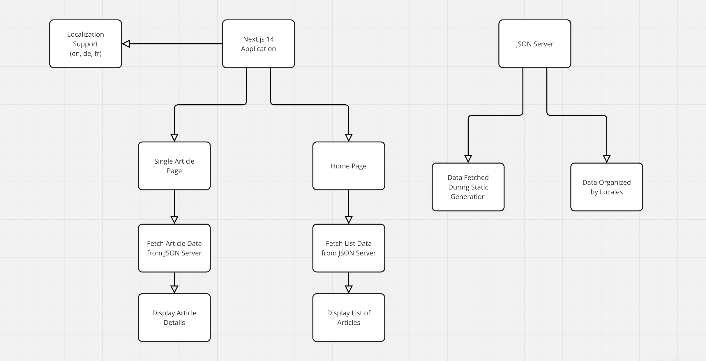

### Getting Started

First launch json server `npx json-server db.json --port 8000` to be able to fetch data.

Second, run the client development server with `yarn dev`

Open [http://localhost:3000](http://localhost:3000) with your browser to see the result.

Software design diagram
